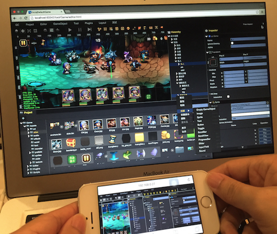
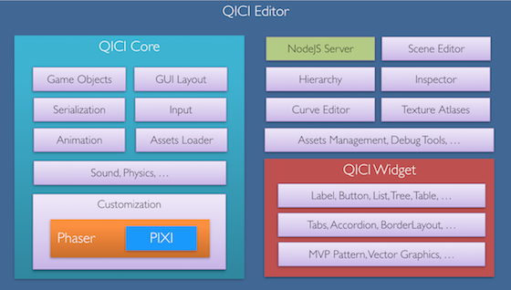

# QICI Engine

- [Introduction](#introduction)
- [Technology Stack](#technology-stack)
- [Getting Started](#getting-started)
- [Getting Help](#getting-help)
- [Documentation](#documentation)
- [Examples](#examples)
- [Upgrading](#upgrading)
- [Opening Issues](#opening-issues)
- [Contributing](#contributing)
- [Changelog](#changelog)
- [Stay In Touch](#stay-in-touch)
- [License](#license)

## Introduction

QICI Engine is a free and open source JavaScript game engine library with a web-based comprehensive suite of toolset for making HTML5 games. 

With QICI Engine, creating HTML5 Games just like Web Development, use your favorite code editor, use your favorite web browser, leverage JavaScript language and all the best web development tools, QICI Engine takes care of the complexity of the underlying technologies, so you just focus on what's important - making your game!

## Technology Stack

QICI Engine is based on the free and open source HTML5 game framework [Phaser](http://phaser.io/), which uses [Pixi.js](http://www.pixijs.com/) for WebGL and Canvas rendering across desktop and mobile web browsers. 

Phaser is actively developed and maintained by [@photonstorm](https://twitter.com/photonstorm), but QICI Engine uses the specific version Phaser 2.3.0. We keep track of bug fixes and performance improvements for Phaser, so you can use the customized Phaser version that QICI Engine provides safely.

QICI Engine is made up of three parts: QICI Core, QICI Widget and QICI Editor:  

- **QICI Core**: A JavaScript Game Engine library that is based on Phaser.
- **QICI Widget**: A JavaScript UI library for creating rich application.
- **QICI Editor**: A web-based editor with a [Node.js](http://nodejs.org/) server for accelerating HTML5 game development.

QICI Core can be used to make a HTML5 Game by writing code without QICI Editor. But for complex UI, it’s really hard to build and maintain without the help of WYSIWYG visual interface, with QICI Editor even artists and designers can help to build the game’s UI. 

QICI Widget provides the HTML5 UI widgets for making the GUI in QICI Editor.

QICI Core is a JavaScript Game library, QICI Widget is a JavaScript UI library, and QICI Editor uses Node.js for accessing the file system, so QICI Engine is a Full-Stack JavaScript Game Engine.

## Getting Started

## Getting Help

## Documentation

## Changelog

Details changes for each release are documented in the [release notes](release-notes.md). We recommend you use the latest version of QICI Engine.

## Stay In Touch

If you use [Slack](http://slack.com/) and would like to join the [QICI Engine channel](http://qiciengine.slack.com) then please [drop we an email](mailto:linyw@qcplay.com?subject=Slack Invite&body=Please invite me to the QICI Engine slack channel.%0A%0AMy%20email%20address%20is%3A%20___%0AMy%20first%20name%20is%3A%20___%0AMy%20last%20name%20is%3A%20___). All we need is your email address, first name and last name and then we can send you an invite to the channel.

If you want to keep up to date with the latest QICI Engine news then feel free to follow us on [Twitter](https://twitter.com/qiciengine) and we will keep you posted!

For more Information, please visit our official [QICI Engine webstie](http://www.qiciengine.com) or [Chinese website](http://www.zuoyouxi.com). 

## License

QICI Engine is released under the [MIT License](http://opensource.org/licenses/MIT).
